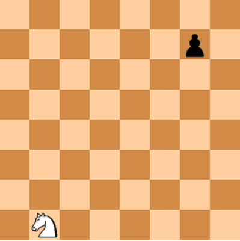
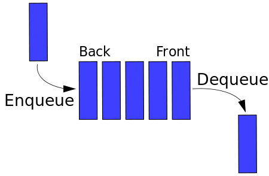
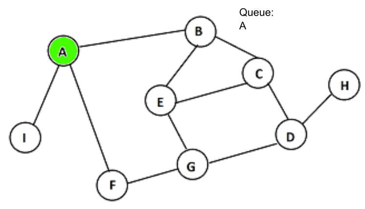
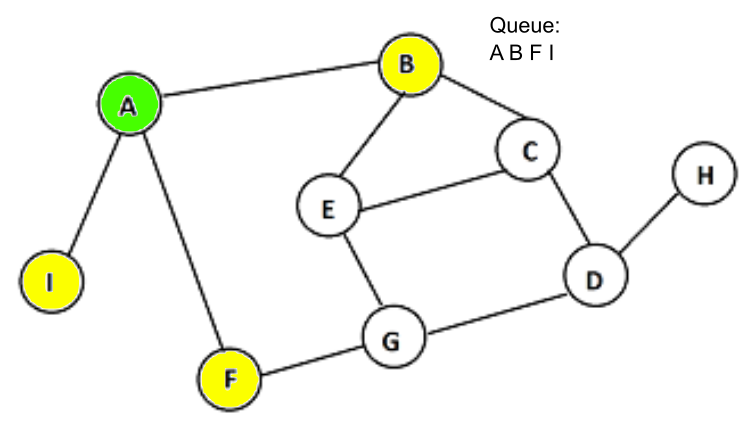
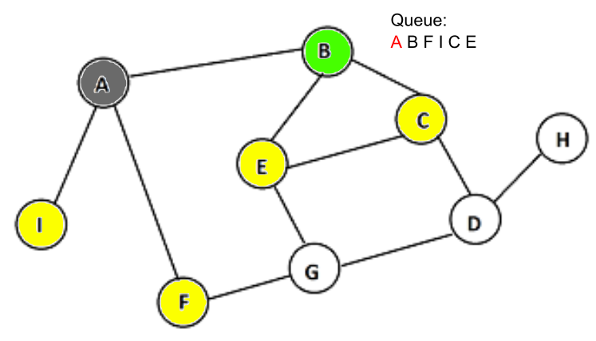
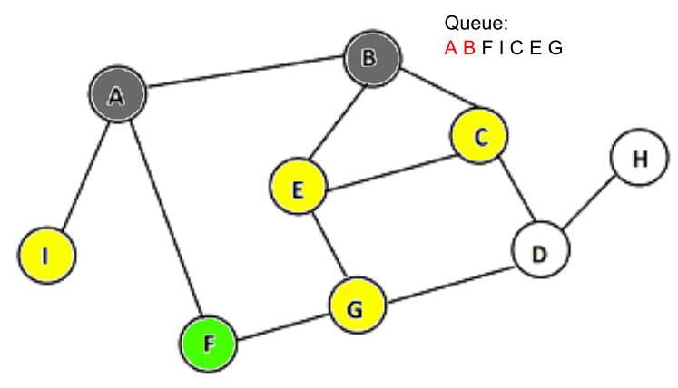
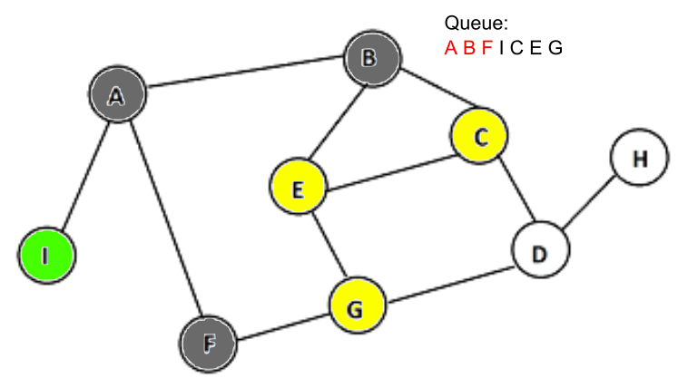
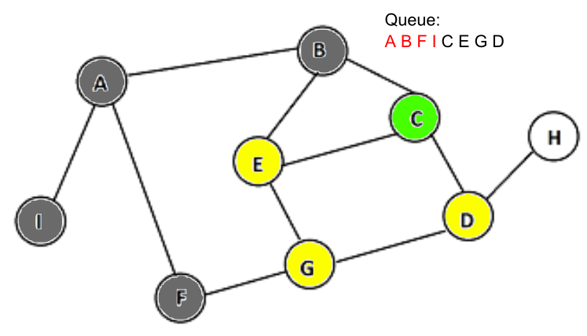

# Breadth-First Search
Let's say we wanted to find out the minimum number of steps the knight could take to get to the pawn.

We could probably determine the answer to this problem fairly quickly in our head. But how would we use a computer to solve this problem efficiently?

Breadth-first search, or simply BFS, is a search algorithm which can be used to find the minimum number of steps to get from one place to another. BFS uses a data type called a "queue", which follows a First-In-First-Out (FIFO) method. This means that the first object added into a queue will always be the first to be removed.

To start BFS, a tree node (the starting point of BFS) is added to a queue.

Its neighbors, or surrounding nodes, are then scanned and added to the queue as well.

After doing so, the tree node is then removed from the queue, and the next node in the queue is scanned for neighbors as well. This process continues until all nodes have been checked.

   
<!-- 46ff00ff (green) 6a6a6aff (grey) fcff00ff (yellow)-->